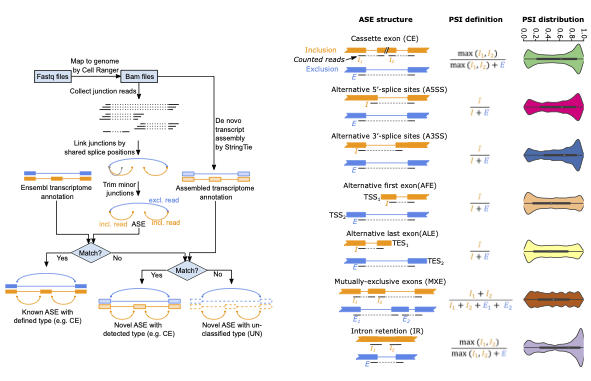

# JAseC
**J**unction-based **A**lternative **s**plicing **e**vent **C**ounter (JAseC) is a bioinformatic program to detect and quantify alternative splicing events (ASEs) from 10x Genomics single-cell RNAseq data. JAseC detects reads spanning exon-exon junctions within a gene, while discovering all types of ASEs without relying entirely on transcript annotation. It quantifies ASEs at the single-cell level based on barcodes,  accomodates uneven read coverages, and incorporating unique molecular identifier (UMI) information to handle single-cell data (Figure 1d; see Methods). JAseC only considers ASEs supported by at least 10 junction reads, allowing both a reference and alternative AS isoform to be defined.

## System requirements
JAseC is designed to run from the Linux command line in an environment compatible with the Julia programming language and with at least 64 GB of RAM.

## Installation
Running JAseC relies on Julia language compiler on Linux OS. First of all, the user needs to install Julia (v1.6+). A binary version of Julia program can be downloaded from the [official website](https://julialang.org/downloads/).

JAseC can then be installed by running the below code in bash:
```bash
$ julia -e 'using Pkg; Pkg.add(PackageSpec(url="https://github.com/lambrechtslab/JAseC.git"))'
```
Alternatively, JAseC can be installed under julia package environment (press key `]` in Julia REPL):
```julia
(v1.9) pkg> add https://github.com/lambrechtslab/JAseC.git
(v1.9) pkg> build JAseC
```
The dependent packages and the external tool `StringTie` will be installed automatically. A symbolic link `~/JAseC` will be created in your home directory, which you may move to another location if desired.

## Uninstallation
To uninstall JAseC, remove the package from Julia and delete the symbolic link:
```
$ julia -e 'using Pkg; Pkg.rm("JAseC")'
$ unlink ~/JAseC
```

## Usage
### Input data preparation
Before running JAseC, FASTQ files generated from the 10x Genomics scRNA-seq platform should first be aligned using `cellranger`. It is optional—but highly recommended—to perform cell type identification beforehand.

JAseC requires the following files as input:
1. The bam files output from `cellranger`.
2. A sample sheet tsv file with two columns: sample ID (unique and no blanks), and bam file path.
3. A genome annotation file (gtf). This file is suggested to use the same version as in the previous `cellranger`. For example, the Ensembl v93 human annotation gtf file can be downloaded from [here](https://ftp.ensembl.org/pub/release-93/gtf/homo_sapiens/Homo_sapiens.GRCh38.93.gtf.gz). `.gz` compressed file is accepted.
4. (Optional, but recommended) A tsv file for the cell group information, which should be composited by three columns: sample ID (identical to file #2), cell barcode (do not include `-1` at the end of barcode), and name of cell group (like cell type as an example). This file can be in compressed in .gz format. If provided, JAseC will calculate PSI and counts for each cell groups. Considering read coverage on single-cell level is limited, appropriately grouping cells could largely facilitate downstream analysis.
5. (Optional) A de-nova assembled GTF file. If not supplied, JAseC will automatically generate one based on the input bam files and annotation files using `StringTie`.
### Run JAseC program
```bash
$ ~/JAseC -g ANNOTATION.gtf(.gz) -s SAMPLESHEET.tsv [-p THREAD] \
      	     [-c CELL_BARCODE.tsv(.gz)] [-o OUTPUT-DIR] \
             [--assembled-annotation ASSEMBLED_ANNOTATION.gtf(.gz)] \
	     [--stringtie STRINGTIE_PROGRAM] [--temp-dir TEMP_DIR]
```
If `julia` is not in `$PATH` environment, run the below command instead:
```bash
$ /path/to/julia ~/JAseC ...
```
#### Common arguments:
*  `-g`, `--ref-annotation` _ANNOTATION.gtf_ GTF files of public reference annotation.
*  `-s`, `--samplesheet` _SAMPLESHEET.tsv_
                        A tsv file with columns of sample id and bam files. Sample ID should be unique and without internal blanks.
*  `-c`, `--cell-barcode` _CELL_BARCODE.tsv(.gz)_
                        A tsv(.gz) file with columns of sample id, cell barcode and cell group.
*  `-o`, `--output-dir` _OUTPUT_DIR_ Directory of the outputs. JAseC will create one if not exists. (default: ".")
*  `-p`, `--thread` _THREAD_ Number of threads to run JAseC. An efficient thread number is no larger than the number of input bam files. (default: 1)
#### Other arguments:
*  `--assembled-annotation` _ASSEMBLED_ANNOTATION.gtf_  GTF files of de-noval assembled annotation. If missing, JAseC will assemble it from bam files using StringTie.
*  `--stringtie` _STRINGTIE_CMD_ Command of `StringTie` software. When missing, the internal `StringTie` will be used.
*  `--temp-dir` TEMP_DIR Tempary directionary. (default: "_tmp")
#### Tips
* If `_tmp/` already exists, JAseC will consider it as an interrupted task and try to recover from the last calculation. If you want to recalculate from scratch, please remove this folder first.
## Output files explanation
*  `detected_ASE_info.tsv` Features of each detected ASEs, including gene name, splicing type, inclusion/exclusion junction coordinates, etc. The second exon junction `E_junc_B` is only for mutiple-exclusive-exon (MXE).
*  `[SampleID]_count_per_ASE_perCell.tsv.gz`  The junction read numbers per cell. For MXE, the column `E_junc_count` is the sum of two exclusion junction counts.
*  `[SampleID]_count_perASE_perCellGroup.tsv.gz`  The junction read number and PSI per cell type. This file is only available when `--cell-barcode` _CELL_BARCODE.tsv(.gz)_ was given.
#### In the chart below, the left panel shows a schematic diagram of the JAseC pipeline, while the right panel illustrates, for each splicing type, which reads are counted as exclusion reads (E) and inclusion reads (I) by JAseC, and how the PSI value is calculated.

## Demo
This demo shows how to use JAseC to detect and quantify ASEs in single-cell data of 1000 peripheral blood mononuclear cells (PBMCs) from a Healthy Donor, which is publicly available on the 10x Genomics website as an example dataset. For this data, libraries were generated using the 10x Genomics 3' Single Cell Gene Expression v3 chemistry, and the data were pre-analyzed with Cell Ranger version 3.0 to obtain the aligned BAM file and cell clustering information.

First, download the example bam file of 10x single-cell data (4.5G) into working directory:
```
$ wget https://cf.10xgenomics.com/samples/cell-exp/3.0.0/pbmc_1k_v3/pbmc_1k_v3_possorted_genome_bam.bam
```
And prepare a sample sheet file:
```
$ echo -e "sample1\tpbmc_1k_v3_possorted_genome_bam.bam" > samplesheet.tsv
```
Next, download human genome annotation file into working directory:
```
$ wget https://ftp.ensembl.org/pub/release-93/gtf/homo_sapiens/Homo_sapiens.GRCh38.93.gtf.gz
$ gunzip Homo_sapiens.GRCh38.93.gtf.gz
```
Then we download the cell clustering result and use the major clusters as cell groups:
```
$ wget https://cf.10xgenomics.com/samples/cell-exp/3.0.0/pbmc_1k_v3/pbmc_1k_v3_analysis.tar.gz
$ tar zxf pbmc_1k_v3_analysis.tar.gz analysis/clustering/graphclust/clusters.csv
$ cat analysis/clustering/graphclust/clusters.csv | sed 1d | awk -F'-1,' '{print "sample1\t"$1"\tcellgroup"$2}' > cell_barcode.tsv
```
Finally, run JAseC. It takes approximately one hour.
```
$ ~/JAseC -g Homo_sapiens.GRCh38.93.gtf -s samplesheet.tsv -c cell_barcode.tsv -o JAseC_output
```
The outputs will be in the folder `JAseC_output/`.
## Contacts
Jieyi Xiong (jieyi.xiong[at]kuleuven.be); Diether Lambrechts (diether.lambrechts[at]kuleuven.be)
